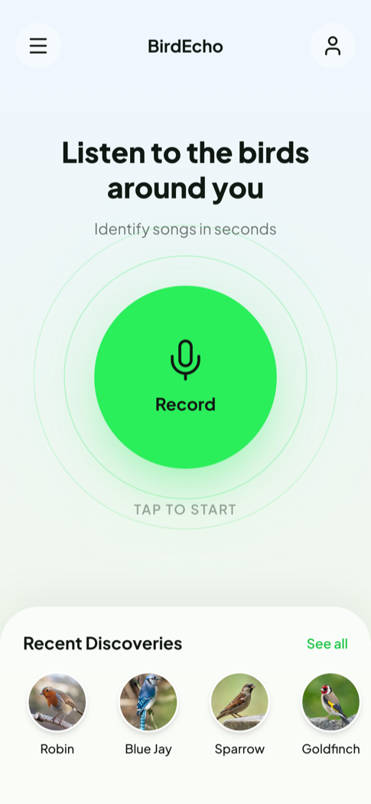
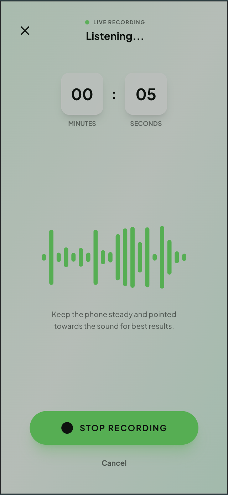
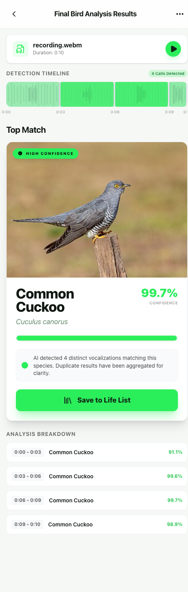

# Bird Echo

> 鸟类识别 Web 应用 - 录制或上传音频，AI 自动识别鸟类物种

Bird Echo 是一个端到端的鸟类识别解决方案。通过设备麦克风录制或上传音频文件，自动识别其中的鸟类叫声，并展示详细的检测结果和物种信息。

## 项目简介

- **前端** (React + TypeScript): 现代化用户界面，支持实时录音和结果可视化
- **后端** (Python FastAPI): 高性能 API 服务，调用 BirdNET-Analyzer 进行音频分析

## 界面展示

| 主页 | 录音中 | 分析结果 |
|:---:|:---:|:---:|
|  |  |  |

## 功能特性

- **实时录音** - 使用原生 MediaRecorder API，支持 WebM/MP4 格式
- **音频回放** - 结果页面可播放/暂停录音
- **文件上传** - 支持多种音频格式 (WAV, MP3, FLAC, WebM, MP4)
- **AI 识别** - 基于 BirdNET-Analyzer 深度学习模型
- **可视化结果** - 时间轴热力图展示检测结果
- **物种信息** - 后端代理从 Wikipedia 获取鸟类图片并本地缓存
- **音频转换** - 后端使用 ffmpeg 自动转换格式
- **图片缓存** - 鸟类图片本地缓存，避免重复下载

## 技术栈

### 前端
- React 19 + TypeScript
- Tailwind CSS 样式
- 原生 MediaRecorder API (录音)
- Lucide React (图标)

### 后端
- Python 3.9 ~ 3.11
- FastAPI + Uvicorn
- BirdNET-Analyzer (AI 模型)
- ffmpeg (音频转换)
- httpx (HTTP 客户端，用于图片下载和缓存)

## 快速开始

### 前置要求

- Python 3.9 ~ 3.11 (不支持 3.12)
- Node.js 18+
- ffmpeg (音频转换必需)

### 后端安装

```bash
cd server

# 创建虚拟环境
uv venv --python 3.11
source .venv/bin/activate  # Windows: .venv\Scripts\activate

# 仅 macOS - 先安装构建工具
brew install cmake llvm@20
export LLVM_DIR="/usr/local/opt/llvm@20/lib/cmake/llvm"

# 安装依赖
uv pip install birdnet_analyzer
uv pip install -r app/requirements.txt

# 安装 ffmpeg
# macOS:   brew install ffmpeg
# Ubuntu:  sudo apt-get install ffmpeg
# Windows: https://ffmpeg.org/download.html

# 配置模型（必需）
python setup_models.py

# 启动服务器
uvicorn app.main:app --reload --host 0.0.0.0 --port 3001
```

### 前端安装

```bash
cd app
npm install
npm run dev
```

访问 http://localhost:3000 开始使用。

#### 移动端预览与远程调试

项目支持两种移动端调试方案，首选 **Cloudflare Tunnel** 方案：

##### 方案 A：Cloudflare Tunnel (推荐，跨网络支持)
利用 Cloudflare 建立内网穿透隧道，让手机在任何地方都能访问电脑上的开发环境：

1.  **启动隧道**：分别运行前端 (3000) 和后端 (3001) 的隧道。
2.  **配置环境**：在 `app/.env` 中填入后端隧道生成的随机域名。
3.  **开始预览**：在手机上访问前端隧道生成的链接。

详细步骤请参考：[移动端预览与远程调试指南](docs/mobile-preview-guide.md)

##### 方案 B：局域网直连 (同 Wi-Fi)
1.  确保电脑和手机连接到同一 Wi-Fi。
2.  在手机浏览器访问电脑的局域网 IP 地址（如 `https://192.168.1.100:3000`）。
3.  需通过 `vite-plugin-mkcert` 开启 HTTPS 以支持麦克风。

**注意**: 无论哪种方案，手机端必须通过 **HTTPS** 访问才能正常唤起麦克风录音权限。

## 项目结构

```
bird-echo/
├── app/                     # React 前端
│   ├── screens/            # 页面组件
│   │   ├── HomeScreen.tsx       # 主页，带录制按钮
│   │   ├── RecordingScreen.tsx  # 录音界面
│   │   └── ResultsScreen.tsx    # 结果展示
│   ├── hooks/              # 自定义 Hooks
│   │   └── useMediaRecorder.ts  # 录音 Hook
│   ├── services/           # API 层
│   │   └── api.ts
│   └── components/         # UI 组件
│
└── server/                 # FastAPI 后端
    ├── app/
    │   ├── main.py         # 应用入口
    │   ├── routes/         # 路由处理器
    │   │   └── analyze.py  # 音频分析 API，图片代理
    │   ├── services/       # 业务逻辑
    │   │   └── birdnet_service.py
    │   └── utils/          # 工具类
    │       ├── csv_parser.py
    │       ├── audio_converter.py
    │       └── temp_cleaner.py
    ├── uploads/            # 临时上传目录
    ├── outputs/            # 分析结果目录
    └── image_cache/        # 鸟类图片缓存目录
```

## API 接口

### POST /api/analyze

上传音频文件并返回鸟类识别结果。

**请求**:
```
Content-Type: multipart/form-data
audio: <音频文件>
```

**响应**:
```json
{
  "success": true,
  "data": {
    "fileName": "recording.webm",
    "analysisTime": 2.45,
    "detections": [
      {
        "startTime": "0:00",
        "endTime": "0:03",
        "scientificName": "Cuculus canorus",
        "commonName": "Common Cuckoo",
        "confidence": 0.99,
        "label": "Common Cuckoo (Cuculus canorus)"
      }
    ],
    "summary": {
      "totalDetections": 1,
      "speciesCount": 1,
      "audioDuration": "0:03"
    }
  }
}
```

### GET /api/health

健康检查端点。

### GET /api/bird-image

获取鸟类图片（后端代理，带缓存）。

**请求**:
```
GET /api/bird-image?scientific_name=Cuculus%20canorus
```

**响应**:
```json
{
  "success": true,
  "imageUrl": "/api/bird-image-file/8ac64591370c7c9d2034af97a481ab51.jpg"
}
```

### GET /api/bird-image-file/{cache_key}

返回缓存的鸟类图片文件。

## 数据流

**音频分析流程**:
```
用户录音/上传 → MediaRecorder 创建 Blob (WebM/MP4)
     ↓
前端发送到 /api/analyze (multipart/form-data)
     ↓
后端保存到 uploads/{session_id}/
     ↓
ffmpeg 转换为 WAV (22050Hz, mono, 16-bit PCM)
     ↓
BirdNET-Analyzer 分析
     ↓
解析 CSV 结果，返回 JSON 响应
```

**鸟类图片获取流程**:
```
前端请求 /api/bird-image?scientific_name={name}
     ↓
后端检查本地缓存 (image_cache/{md5_hash}.*)
     ↓
缓存命中 → 返回 /api/bird-image-file/{cache_key}{ext}
缓存未命中 → Wikipedia API 获取图片
     ↓
下载图片到本地缓存，MD5 哈希作为文件名
     ↓
返回后端代理 URL
```

## 常见问题

### BirdNET 模型下载失败？

官方 `birdnet_analyzer` 包的模型下载链接已失效。请运行项目中的 `setup_models.py` 脚本，它会从 Zenodo 下载模型。

### ffmpeg 未安装？

后端音频转换需要 ffmpeg。未安装时会返回错误。请根据你的操作系统安装 ffmpeg。

### Python 3.12 不兼容？

BirdNET-Analyzer 目前不支持 Python 3.12。请使用 Python 3.9、3.10 或 3.11。

## 开发

查看 [CLAUDE.md](./CLAUDE.md) 了解详细的开发指南和架构说明。

## 许可证

MIT License

## 致谢

- [BirdNET-Analyzer](https://github.com/birdnet-team/BirdNET-Analyzer) - 鸟类识别 AI 模型
- [Wikipedia REST API](https://en.wikipedia.org/api/rest_v1/) - 鸟类图片和描述数据（后端代理访问）
